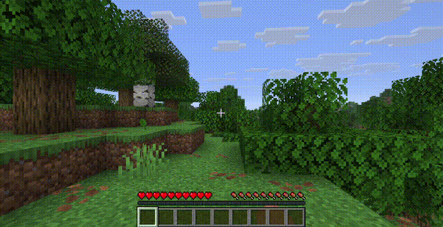

# Keep Walking

[](https://minecraft.net)
[](https://fabricmc.net)
[](LICENSE)

Move freely while your inventory is open — no more standing still when managing items.



## Features

- **WASD movement** through all container screens (inventory, chests, crafting table, etc.)
- **Jumping** while screens are open
- **No pause in singleplayer** — the world keeps ticking behind your inventory
- Respects your **key bindings** — works with rebinded movement keys

## How It Works

Two lightweight mixins that patch vanilla behavior:

| Mixin | Target | Effect |
|-------|--------|--------|
| `KeyboardInputMixin` | `KeyboardInput.tick()` | Polls raw GLFW key state for movement keys when an `AbstractContainerScreen` is open, bypassing screen input capture |
| `AbstractContainerScreenMixin` | `AbstractContainerScreen.isPauseScreen()` | Returns `false` so the integrated server doesn't pause in singleplayer |

Vanilla consumes movement key events when a container screen is open — the screen's `keyPressed` handler intercepts them before they reach the key binding system. This mod checks the physical keyboard state directly via `InputConstants.isKeyDown()` when a container screen is active, then computes both `keyPresses` and `moveVector` exactly like vanilla does.

## Installation

1. Install [Fabric Loader](https://fabricmc.net/use/) for Minecraft 26.1.x
2. Install [Fabric API](https://modrinth.com/mod/fabric-api) (0.145.4+)
3. Download `keep-walking-1.0.0.jar` from [Releases](https://github.com/Cukkoo12/keep-walking/releases)
4. Place in `.minecraft/mods/`

## Build from Source

```bash
git clone https://github.com/Cukkoo12/keep-walking.git
cd keep-walking
./gradlew build
# JAR in build/libs/
```

Requirements: Java 25, Gradle 9.4+

## License

MIT — do whatever you want.
